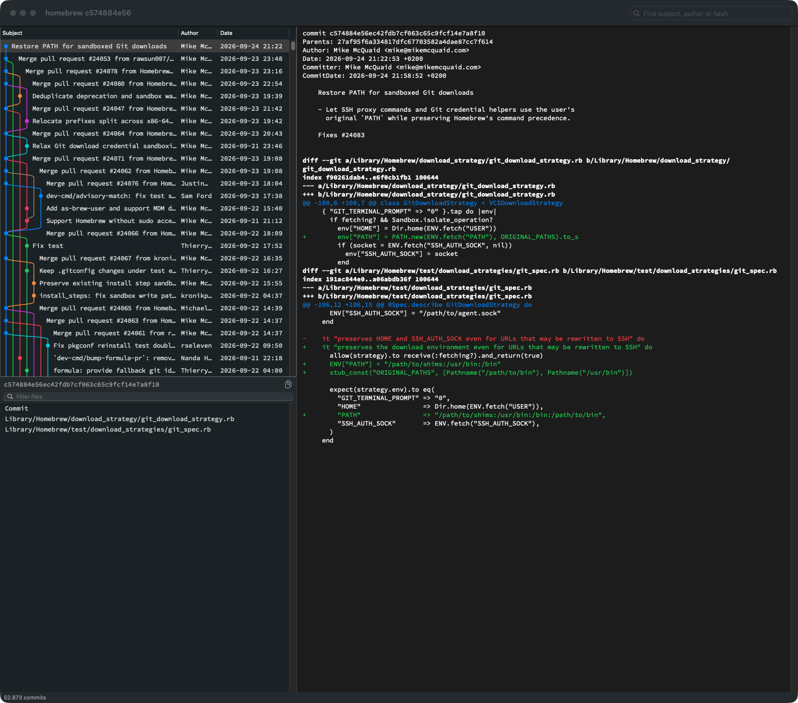

# gitview

A plain git history viewer for macOS. Like gitk, without Tk.

> **This project is 100% vibe coded.** Every line of code, test and doc was written by an AI (Claude) in a chat. A human only described what they wanted, used the app, and said what to change.



## Why

gitk does one job well: it shows the history. But it runs on Tk (`wish`), and on a Mac that means:

- ugly, blurry fonts and a dated look
- slow on big repos
- clunky keys, scrolling and windows

Most other git tools try to be clever: staging, rebasing, dashboards. We only wanted to see the history. So gitview does what gitk does, as a native Mac app, and nothing more. It never changes your repo.

## What it shows

- **Commits** with a branch/merge graph, branch and tag labels, author and date.
- **The selected commit's hash**, with a copy button.
- **Changed files**, with a filter. Click one to jump to it in the diff.
- **The diff**, colored, with long lines wrapped.
- **Commit messages highlighted**, using the same rules as vim/nvim's `gitcommit` syntax: a `type(scope)!:` prefix is bold, `fixup!`/`amend!` blue, and trailers like `Co-Authored-By:` red. Subjects in the commit list too.

The window, panel sizes, font and theme (View → Appearance: Light, Dark or System) are remembered.

## Install

Built for macOS 14 or later (only tested on macOS 27). Needs the Xcode Command Line Tools (`xcode-select --install`); full Xcode is not needed.

```
make install
```

This builds `~/.local/share/gitview/gitview.app` and links `~/.local/bin/gitview` to it. Make sure `~/.local/bin` is on your `PATH`.

## Use

Run it inside a repo. It takes any `git log` arguments:

```
gitview                  # current branch
gitview --all            # all branches
gitview main..feature    # commits in feature, not in main
gitview -- src/          # only commits touching src/
gitview --author=ada
```

The terminal is free right away. Each run opens its own window.

## Keys

| Key | Action |
|---|---|
| ↑ ↓ | Move in the focused list |
| Tab / Shift+Tab | Next / previous pane: commits → diff → files |
| Space / Shift+Space | Scroll the diff down / up |
| Cmd+F or / | Find: commits in the commit list, file names in the file list, text in the diff |
| Enter, Cmd+G / Shift+Cmd+G | Next / previous commit match |
| Esc | Leave the search box |
| Cmd+C | Copy the commit hash (or the file path in the file list) |
| Cmd+R | Reload |
| Cmd+T | Choose a font (default: Source Code Pro 12) |
| Cmd+= / Cmd+- / Cmd+0 | Bigger / smaller / default font |

## How it works

- History comes from `git log`, diffs from `git show`. Nothing else touches the repo.
- The graph is laid out as commits stream in, so big repos show up at once and load in the background.
- The `gitview` command asks macOS to start `gitview.app`. Started straight from the shell, macOS would group it with the terminal and show "App Running in Background" every time it quits.

## Logs

Logs go to `~/.gitview/logs/YYYY-MM-DD.log` and are kept for 14 days. Include them when reporting a problem.

## Develop

```
make test               # unit tests
make run ARGS="--all"   # run a dev build in the terminal
```

A dev build (`swift build`) runs attached to the terminal. `GITVIEW_FOREGROUND=1` does the same for the installed app. The design is in [docs/superpowers/specs](docs/superpowers/specs). `make icon` redraws the app icon from `app/make-icon.swift`.

## License

[MIT](LICENSE)
